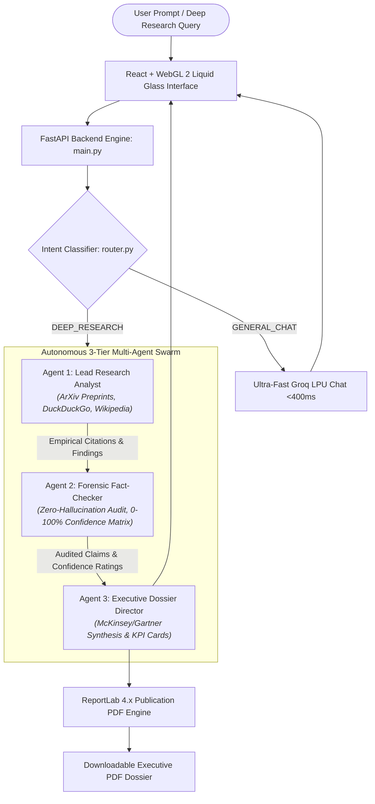

# ⚡ VERAXIS AI — Autonomous Scientific Research & Strategic Intelligence Platform

[](https://www.python.org/)
[](https://fastapi.tiangolo.com)
[](https://react.dev/)
[](https://crewai.com)
[](https://opensource.org/licenses/MIT)
[-brightgreen.svg)](test.py)

> **Enterprise-Grade Multi-Agent Research Platform & AI SaaS Engine**  
> Formulated for deep-tech literature reviews, zero-hallucination forensic claim auditing, and one-click publication-grade McKinsey/Gartner style PDF dossiers.

---

## 1. System Architecture & Workflow

VERAXIS AI operates on a high-throughput dual-engine paradigm:



---

## 2. Industry Standard Directory Structure

```
MULTIINTELIGENCE/
├── backend/                       # Python Backend Service & AI Orchestration
│   ├── __init__.py                # Package root & metadata
│   ├── main.py                    # Core FastAPI server application & routes
│   ├── config.py                  # KeyManager (Round-robin 41-key rotation & failover)
│   ├── router.py                  # Dual-engine intent classifier & fast chat
│   ├── agents.py                  # 3-Tier CrewAI agent definitions
│   ├── tasks.py                   # Sequential discovery, audit, and synthesis tasks
│   ├── tools.py                   # ArXiv, DuckDuckGo, and Wikipedia CrewAI tools
│   ├── pdf_generator.py           # Publication-grade ReportLab 4.x PDF engine
│   ├── demo_cache.py              # Offline failsafe cache for live evaluation demos
│   └── helper.py                  # Production helper utilities & system diagnostics
├── frontend/                      # Modern React SaaS Frontend Application
│   ├── src/                       # App.jsx, LiquidLensCanvas, ChatStream, Header, Sidebar
│   ├── public/                    # PWA manifest.json, sw.js, SVG icons
│   ├── dist/                      # Precompiled production build (zero-node deployment)
│   ├── package.json               # Frontend dependencies & scripts
│   └── vite.config.js             # Vite development server & reverse-proxy rules
├── assets/                        # Design Assets, Logos & Configuration Data
│   ├── veraxis_logo.png           # High-resolution platform brand logo
│   └── presets.json               # Curated research domains and seed topic prompts
├── pdf_exports/                   # Storage directory for generated PDF dossiers (.gitkeep)
├── .env                           # Environment secrets (STRICTLY GIT-IGNORED)
├── .env.example                   # Environment configuration template
├── .gitignore                     # Production Git ignore rules
├── main.py                        # Unified CLI launcher & application bootstrapper
├── helper.py                      # Root convenience proxy re-exporting backend.helper
├── requirements.txt               # Pinned production Python dependencies
├── test.py                        # Comprehensive automated test suite (100% green)
└── README.md                      # Complete system documentation
```

---

## 3. Quick Start & Installation

### Step 1: Clone Repository
```bash
git clone https://github.com/devanshd07o/HCL_VERAXIS_DEVANSH.git
cd HCL_VERAXIS_DEVANSH
```

### Step 2: Configure Environment
Copy `.env.example` to `.env` and insert your API keys:
```bash
cp .env.example .env
```
Edit `.env`:
```ini
# Comma-separated Groq API keys for round-robin rotation & rate-limit failover
GROQ_API_KEYS=gsk_your_key_1,gsk_your_key_2

# Fallback LLM (Optional free-tier backup)
GEMINI_API_KEY=your_gemini_api_key_here
```

### Step 3: Install Python Dependencies
```bash
pip install -r requirements.txt
```

---

## 4. Running the Application

### Production Server (FastAPI + React Production Build)
```bash
python main.py
```
* **Web UI**: [http://localhost:8000](http://localhost:8000)
* **API Documentation**: [http://localhost:8000/docs](http://localhost:8000/docs)
* **System Health Endpoint**: [http://localhost:8000/api/status](http://localhost:8000/api/status)

### CLI Flags & Diagnostics
```bash
python main.py --help              # Display available options
python main.py --health            # Run non-destructive system diagnostics
python main.py --port 8080         # Bind to a custom port
python main.py --reload            # Hot-reloading mode for development
python main.py --test              # Run full automated test suite directly
```

### Frontend Development Mode (Hot Module Replacement)
```bash
cd frontend
npm install
npm run dev
```
Runs Vite dev server on `http://localhost:5173` with automatic reverse proxy to FastAPI on port 8000.

---

## 5. Automated Testing & Verification

The project includes an industry-standard test suite in [`test.py`](file:///d:/LetsCode/My_Project/MULTIINTELIGENCE/test.py) covering all layers:

```bash
python test.py
```
*Or using pytest:*
```bash
pytest test.py -v
```

### Verified Test Matrix:
| Category | Test Case | Status |
| :--- | :--- | :--- |
| **Helper Utilities** | `test_sanitize_filename` (OS-safe filename generation) | ✅ PASS |
| | `test_estimate_token_count` (BPE heuristic token budgeting) | ✅ PASS |
| | `test_extract_citations_and_links` (ArXiv & URL parser) | ✅ PASS |
| | `test_format_markdown_table` (GFM table formatter) | ✅ PASS |
| | `test_generate_content_hash` (SHA-256 fingerprinting) | ✅ PASS |
| | `test_format_duration` (Human-readable elapsed timing) | ✅ PASS |
| | `test_validate_system_environment` (System diagnostics) | ✅ PASS |
| **Key Management** | `test_telemetry_structure` (Health reporting schema) | ✅ PASS |
| | `test_key_rotation_advances` (Round-robin index advancement) | ✅ PASS |
| **Intent Router** | `test_casual_chat_classification` (Fast Groq chat) | ✅ PASS |
| | `test_deep_research_classification` (Multi-agent routing) | ✅ PASS |
| **PDF Engine** | `test_pdf_generation_output` (ReportLab 4.x `%PDF-` binary output) | ✅ PASS |
| **FastAPI REST API**| `test_root_endpoint` (Root index serving) | ✅ PASS |
| | `test_api_status_endpoint` (Operational health checks) | ✅ PASS |
| | `test_api_suggestions_endpoint` (Dynamic research seed topics) | ✅ PASS |
| | `test_chat_endpoint_empty_query` (Validation error handling) | ✅ PASS |
| | `test_manifest_endpoint` (PWA Web Manifest) | ✅ PASS |
| **Asset Integrity** | `test_presets_json_validity` (`assets/presets.json` schema) | ✅ PASS |
| | `test_logo_asset_exists` (`assets/veraxis_logo.png`) | ✅ PASS |
| | `test_frontend_dist_exists` (`frontend/dist/index.html`) | ✅ PASS |

---

## 6. API Reference

### 1. System Health Telemetry
* **Method**: `GET /api/status`
* **Response**:
```json
{
  "status": "operational",
  "telemetry": {
    "total_keys": 41,
    "active_keys": 41,
    "cooling_down": 0,
    "primary_model": "openai/gpt-oss-120b",
    "gemini_available": true
  },
  "environment": {
    "python_version": "3.11.9",
    "os_platform": "win32",
    "pdf_exports_writable": true,
    "all_checks_passed": true
  }
}
```

### 2. Conversational & Research Dispatcher
* **Method**: `POST /api/chat`
* **Payload**:
```json
{
  "query": "Commercial viability of solid-state EV batteries by 2028"
}
```
* **Response**:
```json
{
  "type": "research",
  "topic": "Commercial viability of solid-state EV batteries by 2028",
  "sources": [
    {
      "title": "ArXiv: Solid-State Electrolyte Interfaces",
      "url": "http://arxiv.org/abs/2304.12345"
    }
  ],
  "content": "# Executive Summary\n...",
  "pdf_filename": "VERAXIS_Commercial_viability_20260930_101500.pdf"
}
```

### 3. Binary PDF Download
* **Method**: `GET /api/download-pdf/{filename}`
* **Response**: Binary `application/pdf` stream.

---

## 7. Next-Gen SaaS Frontend Roadmap
The frontend is decoupled in [`/frontend`](file:///d:/LetsCode/My_Project/MULTIINTELIGENCE/frontend):
- **Glassmorphic Neuform & WebGL 2 Liquid Canvas**: Continuous super-oval fluid contour ($p = 2.5$) with Snell's law prism dispersion ($n = 1.52$).
- **Installable PWA**: Offline support, desktop dock install, responsive mobile viewport.
- **SaaS Component Suite**: Upcoming rich telemetry dashboard, multi-workspace tabs, team collaboration features, and persistent dossier library.

---

## 8. License & Authorship
- **Author**: Devansh & VERAXIS Engineering
- **License**: MIT License
