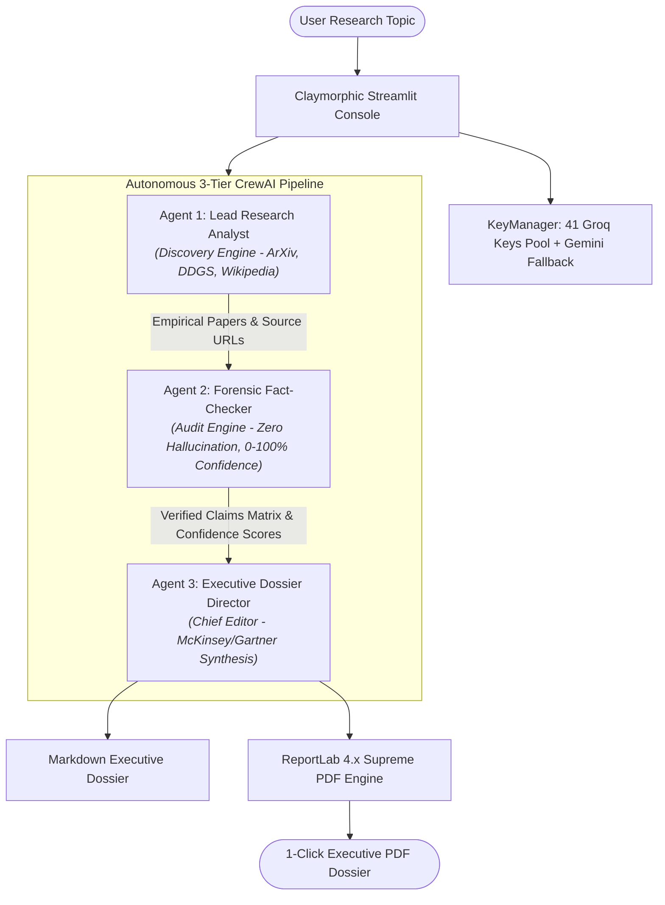

# ⚡ MULTIINTEL AI — Autonomous Multi-Agent Scientific Research & Intelligence Assistant

> **HCL Campus Evaluation — 3rd-Year B.Tech Major Capstone Submission**  
> **Budget Constraint**: Strictly ₹0 (100% Free-Tier APIs & Open-Source Tools)  
> **Architecture**: Autonomous 3-Tier CrewAI System with Round-Robin 41-Key Groq Pool & Gemini Fallback  
> **Document Engine**: ReportLab 4.x Publication-Grade McKinsey/Gartner Style PDF Generator  
> **Design Language**: Claymorphism + High-Density Minimalism  

---

## 1. Executive Summary

**MULTIINTEL AI** is an autonomous multi-agent intelligence and scientific research system designed to eliminate academic hallucination, accelerate deep-tech literature reviews, and produce publication-ready executive briefings with one click.

Given any complex research query (e.g., *"Commercial viability of Solid-State EV Batteries by 2028"*), MULTIINTEL orchestrates three specialized autonomous agents:
1. **Lead Research Analyst**: Retrieves empirical preprints from ArXiv, searches live market news, and grounds core taxonomies in Wikipedia.
2. **Forensic Fact-Checker & Auditor**: Dissects claims, detects conflicting timelines, filters out marketing hyperbole, and computes mathematical confidence ratings (0–100%).
3. **Executive Dossier Director**: Synthesizes verified findings into an executive-grade briefing complete with 3 quantitative KPI cards, verification tables, and structured ReportLab 4.x PDF output.

---

## 2. Multi-Agent Architectural Workflow



---

## 3. The 3-Tier Multi-Agent Crew Specifications

| Agent | Persona & Role | Primary Mission | Integrated Tools | Output Artifact |
| :--- | :--- | :--- | :--- | :--- |
| **Agent 1** | **Lead Research Analyst**<br/>*(DARPA/Bell Labs Veteran)* | Unearth deep scientific studies, recent market announcements, and authoritative statistics. | `arxiv_academic_search`<br/>`duckduckgo_web_search`<br/>`wikipedia_entity_lookup` | Raw findings, ArXiv preprints, author citations, and publication URLs |
| **Agent 2** | **Forensic Fact-Checker**<br/>*(Chief Verification Officer)* | Dissect claims, flag timeline collisions, identify commercial hyperbole, assign confidence (0–100%). | `arxiv_academic_search`<br/>`duckduckgo_web_search` | Verification Matrix (`Claim \| Source \| Status \| Confidence % \| Notes`) |
| **Agent 3** | **Executive Dossier Director**<br/>*(Fortune 500 Strategy Advisor)* | Synthesize complex research into high-impact executive briefings with KPI cards and strategic action items. | *Layout & Synthesis Specialist* | Publication-ready Markdown dossier & ReportLab PDF data payload |

---

## 4. Key Engineering Innovations

### 🛡️ 1. Zero-Cost Multi-Key Round-Robin Failover Pool (`config.py`)
- Automatically rotates across Groq API keys provided via environment variables (`GROQ_API_KEYS` or `GROQ_API_KEY`).
- Features thread-safe round-robin key rotation and automated rate-limit (HTTP 429) cooldown tracking (60s cooldown).
- Instant, non-blocking fallback to **Google Gemini 2.5 Flash** if Groq models hit temporary service interruptions.

### 📄 2. Supreme Publication PDF Engine (`pdf_generator.py`)
- Multi-colour ReportLab 4.x architecture: Indigo Dark (`#3730A3`), Deep Teal (`#0D9488`), and Royal Violet (`#7C3AED`).
- Dynamic two-pass `SupremeNumberedCanvas` computing total pages ("Page X of Y") with precision running headers.
- Tri-colour top rule accent (Indigo 55% → Violet 25% → Teal 20%).
- 3 side-by-side KPI cards with tinted backgrounds and zebra-striped verification data tables.

### 🎨 3. Claymorphic + Minimalist Dashboard (`app.py`)
- Tactile 3D soft extruded cards (`--clay-shadow-out`, `--clay-shadow-in`).
- Live agent pulse telemetry (🟢 Lead Analyst, 🟡 Auditor, 🔵 Editor).
- Interactive Live Agent Thought Stream terminal.
- **Failsafe Offline Demo Switch**: Instant zero-risk presentation mode loading pre-cached research dossiers for live campus viva evaluation.

---

## 5. Directory Scaffold

```
MULTIINTELIGENCE/
├── .env                    # Active API keys (Groq Key Pool + Gemini Fallback)
├── .env.example            # Configuration template
├── requirements.txt        # Frozen dependencies (crewai, streamlit, arxiv, reportlab, etc.)
├── config.py               # KeyManager with 41-key round-robin rotation & fallback
├── tools.py                # ArXiv, DuckDuckGo, and Wikipedia CrewAI tools with fallbacks
├── agents.py               # 3 CrewAI agent definitions with system prompts
├── tasks.py                # 3 sequential research & verification tasks
├── pdf_generator.py        # ReportLab 4.x publication dossier generator
├── demo_cache.py           # Pre-cached domain topics for zero-risk viva demo
├── app.py                  # Claymorphic + Minimalist Streamlit dashboard
└── README.md               # IEEE/HCL project documentation & specifications
```

---

## 6. Quick Start & Execution

### 1. Verify Dependencies
All dependencies are pre-installed in the Python 3.11 environment:
```bash
pip install -r requirements.txt
```

### 2. Launch the Application
Run the Streamlit telemetry dashboard on localhost:8501:
```bash
streamlit run app.py
```

### 3. Viva Evaluation Demo Mode
- In the sidebar, toggle **"⚡ Zero-Risk Viva Demo Mode"** to test and demonstrate the system instantly without waiting for live external network queries.
- Select any of the preset research chips (*Solid-State EV Batteries*, *Quantum Computing & PQC*, *Neuromorphic AI Chips*, *Zero-Knowledge Scaling*).
- Switch tabs to inspect the **Executive Dossier**, **Verification Matrix**, **Live Agent Thought Stream**, and download the **Supreme PDF**.

---

## 7. Submission Details
- **Project**: MULTIINTEL AI
- **Course**: B.Tech Computer Science & Engineering (Major Capstone)
- **Target**: HCL Campus Evaluation
- **License**: MIT Open Source
